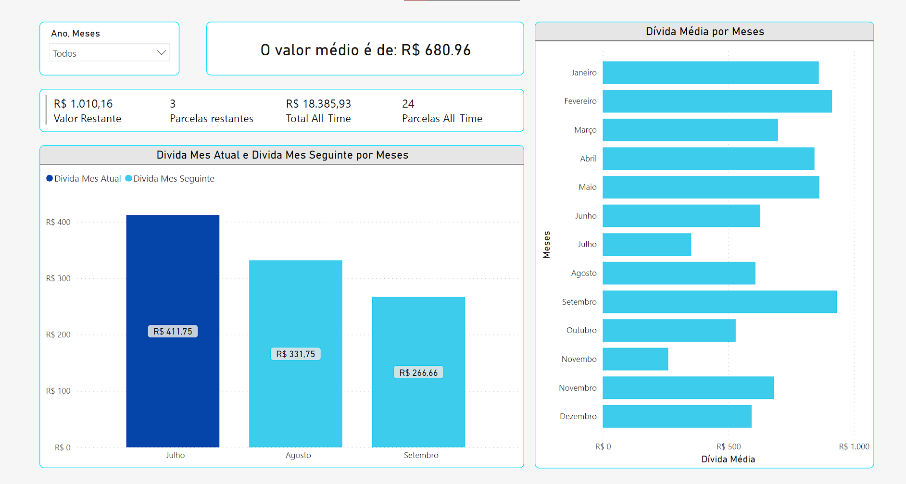

# Projeto de Análise de Dívida Pessoal 📊

Este é um projeto que eu fiz em **Power BI**, uma ferramenta de análise de dados e visualização da Microsoft, para analisar a minha dívida pessoal e planejar o seu pagamento. Ele utiliza uma base de dados que eu criei em **Excel**, um software de planilhas eletrônicas da Microsoft, com os valores das parcelas, os juros e os prazos de uma dívida minha (Vale salienar que os dados foi anonimizados utilizando a função `ALEATÓRIO()` do Excel, para preservar meus dados, uma prática muito comum quando falamos de LGPD).

O objetivo do projeto é mostrar as principais informações sobre a minha situação financeira em um relatório interativo que permite filtrar os dados por ano e mês. Ele também possui alguns gráficos dinâmicos que mostram as tendências e as variações dos dados. Algumas das informações que o relatório apresenta são:

- O valor médio da minha dívida por ano-mês
- O valor restante e as parcelas restantes da minha dívida
- A comparação entre a dívida do mês atual e a dívida do mês seguinte
- A projeção de quando eu vou quitar a minha dívida

Aqui está uma imagem do relatório:

O projeto está disponível no Power BI Desktop através do link abaixo:

[Projeto de Análise de Dívida Pessoal](https://app.powerbi.com/links/4lcQqN1HEo?ctid=da49a844-e2e3-40af-86a6-c3819d704f49&pbi_source=linkShare)

Espero que você goste do projeto e que ele possa te inspirar a controlar melhor as suas finanças. Qualquer feedback ou sugestão é bem-vindo!
